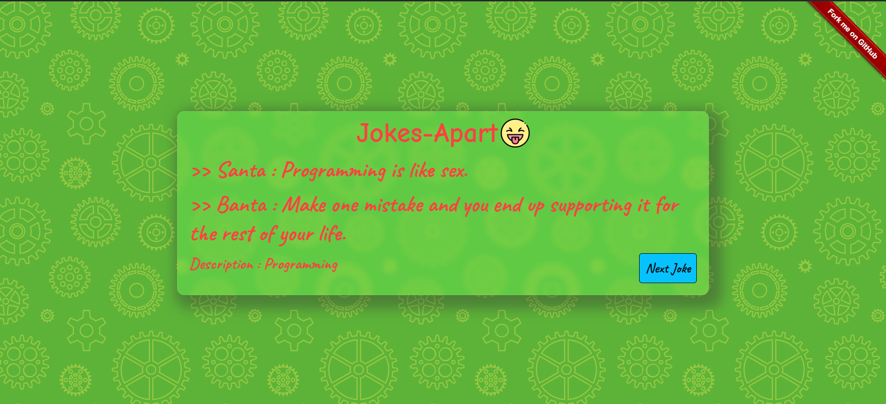

# Jokes Apart

## Overview
**Jokes Apart** is a web application that generates random, funny jokes with a great user interface experience. The application uses the JokeAPI to fetch jokes of various types, ensuring there is something for everyone to enjoy. Built using HTML, CSS, and JavaScript, this project is perfect for anyone looking for a quick laugh with a clean and interactive design.

## Features
- **Random Jokes**: Get a random joke each time you visit or click to fetch a new one.
- **Various Joke Categories**: Includes programming, general, knock-knock jokes, and more.
- **Smooth UI/UX**: The website is designed with a simple yet attractive UI, providing an excellent user experience.
- **Responsive Design**: Optimized for various screen sizes to ensure accessibility on mobile and desktop devices.


## Screenshots


## Installation
1. Clone this repository to your local machine:
   ```bash
   git clone https://github.com/DevSudhanshuRanjan/jokes-apart.git
   ```

2. Navigate to the project directory:
   ```bash
   cd todo-list-app
   ```

3. Open `index.html` in your preferred browser to use the application.

## Technologies Used

- **HTML**: For structuring the web pages.
- **CSS**: For styling the web pages and creating an engaging design.
- **JavaScript**: To handle the logic of fetching jokes from the JokeAPI and interacting with the user interface.
- **JokeAPI**: To get different types of jokes, such as programming jokes, general jokes, etc.


## Contributing
Contributions are welcome! If you'd like to contribute, please fork the repository and make changes as you'd like. Submit a pull request for review.

---

Feel free to reach out with any questions or feedback.